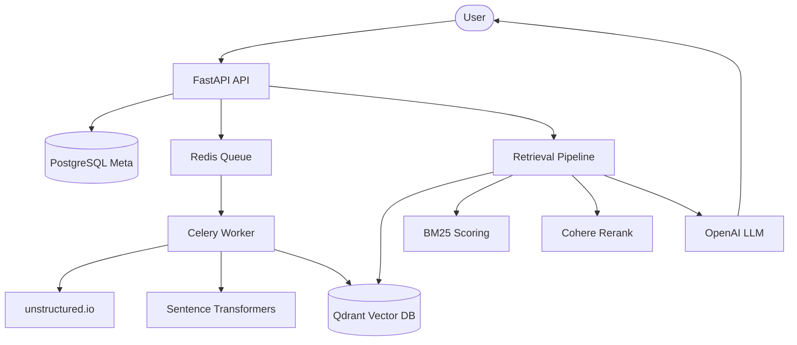

# Enterprise Document Search System with RAG

A high-performance, multi-component Retrieval-Augmented Generation (RAG) system for enterprise document search.

## Features
- **Document Ingestion**: Supports PDF, DOCX, TXT, etc., via `unstructured`.
- **Hybrid Search**: Combines semantic vector search (Qdrant) with keyword search (BM25).
- **Re-ranking**: Integrates Cohere Rerank for superior relevance.
- **LLM Generation**: OpenAI-powered answers with automatic source attribution and citations.
- **Asynchronous Processing**: Background document processing using FastAPI and Celery.
- **Full Containerization**: Orchestrated with Docker Compose.

## Architecture


## Setup Instructions

1. **Clone the repository**
2. **Configure Environment Variables**
   - Copy `.env.example` to `.env`.
   - Add your `OPENAI_API_KEY` and `COHERE_API_KEY`.
3. **Run with Docker Compose**
   ```bash
   docker-compose up --build
   ```
4. **Access the API**
   - API Docs: `http://localhost:8000/docs`
   - Health Check: `http://localhost:8000/health`

## API Usage

### Upload Document
`POST /api/documents` (Multipart form-data)
```bash
curl -F "file=@sample.pdf" http://localhost:8000/api/documents
```

### Check Status
`GET /api/documents/{id}`

### Query System
`POST /api/query`
```json
{
  "query": "What are the key requirements for the project?"
}
```

## Technologies Used
- **Backend**: FastAPI, SQLAlchemy, Celery
- **Vector DB**: Qdrant
- **ML**: Sentence Transformers, OpenAI, Cohere, Unstructured
- **Infra**: Docker, Redis, PostgreSQL
